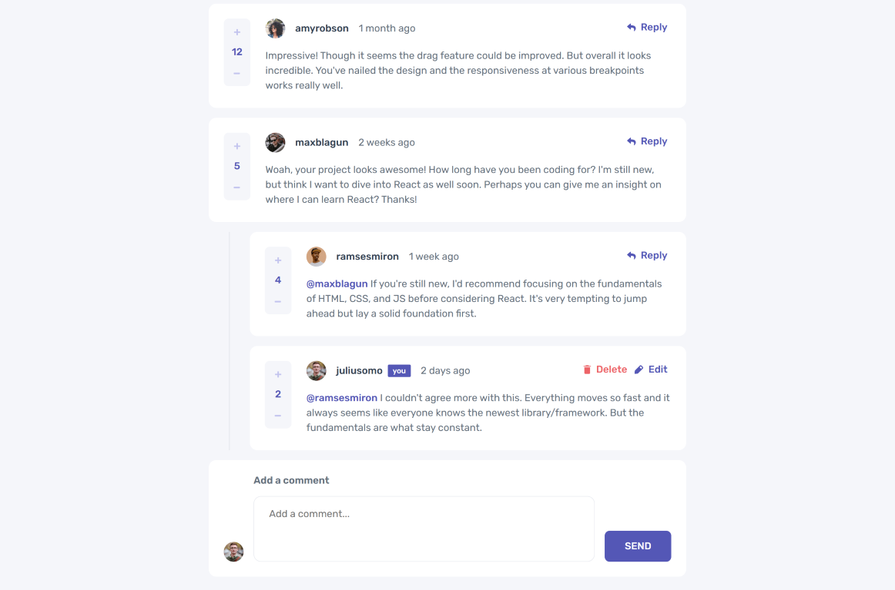

# Interactive comments section solution - Frontend Mentor

This is a solution to the [Interactive comments section challenge on Frontend Mentor](https://www.frontendmentor.io/challenges/interactive-comments-section-iG1RugEG9). Frontend Mentor challenges help you improve your coding skills by building realistic projects.

## Table of contents

-   [Overview](#overview)
    -   [The challenge](#the-challenge)
    -   [Screenshot](#screenshot)
    -   [Links](#links)
-   [My process](#my-process)
    -   [Built with](#built-with)
    -   [What I learned](#what-i-learned)
    -   [Continued development](#continued-development)
    -   [Useful resources](#useful-resources)
-   [Author](#author)

## Overview

### The challenge

Users should be able to:

-   View the optimal layout for the app depending on their device's screen size;
-   See hover states for all interactive elements on the page;
-   Create, Read, Update, and Delete comments and replies;
-   Upvote and downvote comments;
-   **Bonus**: If you're building a purely front-end project, use `localStorage` to save the current state in the browser that persists when the browser is refreshed;
-   **Bonus**: Instead of using the `createdAt` strings from the `data.json` file, try using timestamps and dynamically track the time since the comment or reply was posted.

### Screenshot



### Links

-   [Live Site URL](https://ngsfer-nextjs-comments.vercel.app/)

## My process

### Built with

-   Semantic HTML
-   ARIA attributes
-   Mobile-first workflow
-   [TypeScript](https://www.typescriptlang.org/)
-   [React](https://reactjs.org/)
-   [Next.js](https://nextjs.org/)
-   [Sass](https://sass-lang.com/)
-   [Normalize.css](https://necolas.github.io/normalize.css/)
-   [react-focus-lock](https://github.com/theKashey/react-focus-lock)
-   [ESLint](https://eslint.org/)
-   [Prettier](https://prettier.io/)

### What I learned

In this section, I recap some opportunities that allowed me to learn and apply some concepts while working through this challenge.

#### "App Router" API [introduced by Next.js 13](https://nextjs.org/docs/app/building-your-application/upgrading/app-router-migration)

My first contact with Next.js happened during the migration from the "Pages Router" API to the "App Router" one, with the release of the version 13.

Since then, I have been developing my website ([ngsfer.com](https://ngsfer.com)) using the old API and have decided to continue using it until I finish the project. Throughout this challenge, I gained valuable insights into the upcoming migration process.

#### Accessible Alert Dialogs

Recently, I have been developing a growing interest in creating my own library of reusable components. Through the study of accessible alert dialogs, I had a glimpse of the future challenges in this task.

```tsx
// Code example extracted from the file /components/AlertDialog/alertdialog-content.tsx

import React from 'react'
import { ReactNode } from 'react'
import FocusLock from 'react-focus-lock'

import styles from './styles/alert-dialog.module.scss'

type AlertDialogContentProps = {
    children: ReactNode
    onClose: () => void
}

export default function AlertDialogContent({
    children,
    onClose,
}: AlertDialogContentProps) {
    function handleEsc(event: React.KeyboardEvent) {
        const pressedEsc = event.key === 'Escape'
        if (pressedEsc) onClose()
    }

    return (
        <FocusLock returnFocus>
            <div
                role="alertdialog"
                aria-modal="true"
                aria-labelledby="alertdialog-header"
                aria-describedby="alertdialog-body"
                onKeyDown={handleEsc}
                tabIndex={-1}
                className={styles.alertDialog__content}
            >
                {children}
            </div>
        </FocusLock>
    )
}
```

#### "useMediaQuery" hook to programmatically get the current breakpoint

I have always relied on reusable solutions provided by libraries like Chakra UI and Material UI to handle media queries in JavaScript. However, in this project, I discovered the existence of the `matchMedia` function and applied it as a React hook to address the same responsibility.

```tsx
// Code example extracted from the file /lib/hooks/useMediaQuery.ts

import { useEffect, useState } from 'react'

function useMediaQuery(query: string) {
    const [matches, setMatches] = useState(false)

    useEffect(() => {
        const media = matchMedia(query)
        setMatches(media.matches)

        function synchronizeMediaMatch(event: MediaQueryListEvent) {
            setMatches(event.matches)
        }

        media.addEventListener('change', synchronizeMediaMatch)
        return () => {
            media.removeEventListener('change', synchronizeMediaMatch)
        }
    }, [query])

    return matches
}

export { useMediaQuery }
```

#### [Context-Reducer](https://react.dev/learn/scaling-up-with-reducer-and-context) approach in React

Since I first learned about this approach in the React knowledge base, I wanted to apply it in a project, and I did so in this challenge.

```tsx
// Code example extracted from the file /lib/context/comments/comments-context.tsx
// ...

const CommentsContext = createContext<typeof initialState>([])
const CommentsDispatchContext = createContext<Dispatch<CommentAction> | null>(
    null
)

type CommentsProviderProps = {
    children: ReactNode
}
function CommentsProvider({ children }: CommentsProviderProps) {
    const [comments, dispatch] = useReducer(commentsReducer, initialState)

    return (
        <CommentsContext.Provider value={comments}>
            <CommentsDispatchContext.Provider value={dispatch}>
                {children}
            </CommentsDispatchContext.Provider>
        </CommentsContext.Provider>
    )
}

// ...
```

### Continued development

Topics I want to keep practicing in future projects. These could be both concepts I am still not confortable with or techniques I want to refine and perfect.

-   **Project organization**: the different layers of the application could benefit from better separation, as they often intertwine in the current structure. I believe that organizing the project by dividing it into directories and packages would lead to improved organization and clarity;
-   **Code quality**: there is room for improvement in the implementation of some features, both in terms of efficiency and organization;
-   **Next.js resources**: although I have familiarized myself with some concepts of the new API introduced in Next.js version 13, there are still many others I have not yet experimented with, such as the new fetching system;
-   **Accessibility**: although I made efforts to correctly apply HTML semantic tags and ARIA attributes, I must still ensure that these resources will not cause [accessibility issues](https://www.w3.org/WAI/ARIA/apg/practices/read-me-first/#noariaisbetterthanbadaria);
-   **Truly reusable components**: while developing this project, I implemented some components "internally", like the Alert Dialog, Icon Button, Tag etc. In the future, I plan to extract them into a separate package, creating a reusable component library with enhanced quality in terms of accessibility, usability, and other aspects.

### Useful resources

-   Accessible Alert Dialogs
    -   ["Dialog (Modal) Pattern" at ARIA Authoring Practices Guide](https://www.w3.org/WAI/ARIA/apg/patterns/dialog-modal/);
    -   ["Alert and Message Dialogs Pattern" at ARIA Authoring Practices Guide](https://www.w3.org/WAI/ARIA/apg/patterns/alertdialog/);
    -   ["Using JavaScript to trap focus in an element" by Hidde de Vries](https://hidde.blog/using-javascript-to-trap-focus-in-an-element/) (although I opted to utilize the `react-focus-lock` package, this article provided me with valuable insights into the concept of 'focus trapping' within an element.);
-   React
    -   ["Scaling Up with Reducer and Context" at react.dev](https://react.dev/learn/scaling-up-with-reducer-and-context);
    -   ["Hooks" at React TypeScript Cheatsheets](https://react-typescript-cheatsheet.netlify.app/docs/basic/getting-started/hooks);
-   Responsiveness
    -   ["Window: matchMedia() method" at MDN](https://developer.mozilla.org/en-US/docs/Web/API/Window/matchMedia);
    -   ["Working with JavaScript Media Queries" by Marko Ilic](https://css-tricks.com/working-with-javascript-media-queries/);
-   Sass
    -   ["@use" at sass-lang.com](https://sass-lang.com/documentation/at-rules/use/);
    -   ["@mixin and @include" at sass-lang.com](https://sass-lang.com/documentation/at-rules/mixin/);
    -   ["@each" at sass-lang.com](https://sass-lang.com/documentation/at-rules/control/each/)

## Author

-   [ngsfer.com](https://ngsfer.com/) (website)
