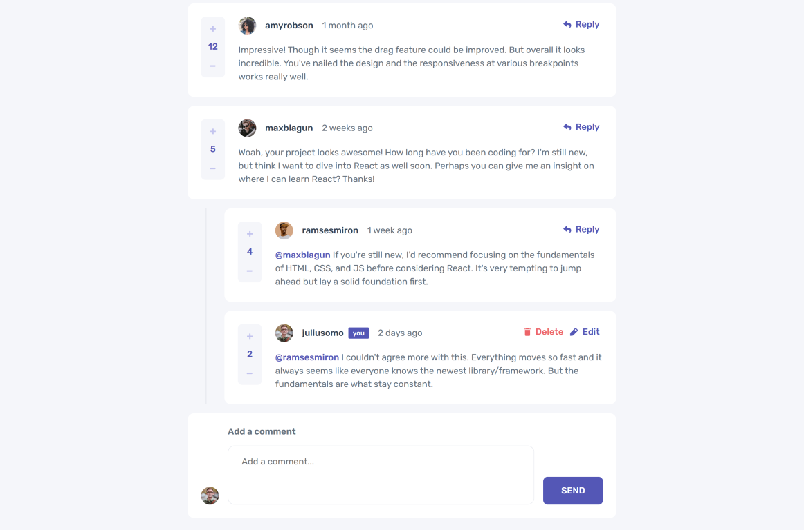

# Solução do desafio "Interactive comments section" - Frontend Mentor

Repositório com a minha solução para o desafio [Interactive comments section challenge on Frontend Mentor](https://www.frontendmentor.io/challenges/interactive-comments-section-iG1RugEG9). Os desafios do Frontend Mentor ajudam a melhorar suas habilidades de programação por meio de projetos realísticos.

## Conteúdo

-   [Visão geral](#visão-geral)
    -   [Sobre o desafio](#sobre-o-desafio)
    -   [Screenshot](#screenshot)
    -   [Links](#links)
-   [Sobre o desenvolvimento](#sobre-o-desenvolvimento)
    -   [Práticas e Tecnologias](#práticas-e-tecnologias)
    -   [O que eu aprendi](#o-que-eu-aprendi)
    -   [Oportunidades futuras](#oportunidades-futuras)
    -   [Recursos úteis](#recursos-úteis)
-   [Sobre o autor](#sobre-o-autor)

## Visão geral

### Sobre o desafio

Os usuários devem ser capazes de:

-   Visualizar o melhor layout para o app de acordo com o tamanho da tela de cada dispositivo;
-   Visualizar estados de "hover" para todos os elementos interativos na página;
-   Criar, ler, atualizar e remover comentários e respostas;
-   Votar positivamente (upvote) ou negativamente (downvote) os comentários;
-   **Bônus**: caso o seu projeto seja apenas front-end, use `localStorage` para salvar o estado atual da aplicação no navegador, de modo que ele persista em diferentes visitas às páginas;
-   **Bônus**: em vez de utilizar as strings `createdAt` originais do arquivo `data.json`, tente utilizar timestamps para gerenciar dinamicamente o tempo desde a publicação do comentário ou resposta.

### Screenshot



### Links

-   [URL do desafio pronto](https://ngsfer-nextjs-comments.vercel.app/)

## Sobre o desenvolvimento

### Práticas e Tecnologias

-   HTML semântico
-   Atributos ARIA
-   Workflow Mobile-first
-   [TypeScript](https://www.typescriptlang.org/)
-   [React](https://reactjs.org/)
-   [Next.js](https://nextjs.org/)
-   [Sass](https://sass-lang.com/)
-   [Normalize.css](https://necolas.github.io/normalize.css/)
-   [react-focus-lock](https://github.com/theKashey/react-focus-lock)
-   [ESLint](https://eslint.org/)
-   [Prettier](https://prettier.io/)

### O que eu aprendi

Algumas oportunidades que me permitiram aprender e reforçar conteúdos durante a resolução deste desafio.

#### API "App Router" [introduzida pelo Next.js 13](https://nextjs.org/docs/app/building-your-application/upgrading/app-router-migration)

Meu primeiro contato com o Next.js ocorreu durante um período de migração da API "Pages Router" para "App Router", com o lançamento da versão 13.

Desde então, estive desenvolvendo meu site ([ngsfer.com](https://ngsfer.com)) utilizando a API antiga, e optei por mantê-la até a finalização do projeto. Com este desafio, pude obter uma noção sobre como será o futuro processo de migração.

#### Alert dialogs acessíveis

Tenho desenvolvido certo interesse de criar minha própria biblioteca de componentes reutilizáveis. Com este estudo sobre alert dialogs acessíveis, pude ter um breve "gostinho" sobre os desafios que enfrentarei.

```tsx
// Exemplo de código extraído do arquivo /components/AlertDialog/alertdialog-content.tsx

import React from 'react'
import { ReactNode } from 'react'
import FocusLock from 'react-focus-lock'

import styles from './styles/alert-dialog.module.scss'

type AlertDialogContentProps = {
    children: ReactNode
    onClose: () => void
}

export default function AlertDialogContent({
    children,
    onClose,
}: AlertDialogContentProps) {
    function handleEsc(event: React.KeyboardEvent) {
        const pressedEsc = event.key === 'Escape'
        if (pressedEsc) onClose()
    }

    return (
        <FocusLock returnFocus>
            <div
                role="alertdialog"
                aria-modal="true"
                aria-labelledby="alertdialog-header"
                aria-describedby="alertdialog-body"
                onKeyDown={handleEsc}
                tabIndex={-1}
                className={styles.alertDialog__content}
            >
                {children}
            </div>
        </FocusLock>
    )
}
```

#### Hook useMediaQuery para acompanhar o breakpoint atual "programaticamente"

Sempre utilizei as soluções prontas, oferecidas por bibliotecas como Chakra UI e Material UI, para lidar com media queries em JavaScript. Neste projeto, aprendi sobre a existência da função `matchMedia` e a apliquei, na forma de um _hook_ do React, para satisfazer essa mesma responsabilidade.

```tsx
// Exemplo de código extraído do arquivo /lib/hooks/useMediaQuery.ts

import { useEffect, useState } from 'react'

function useMediaQuery(query: string) {
    const [matches, setMatches] = useState(false)

    useEffect(() => {
        const media = matchMedia(query)
        setMatches(media.matches)

        function synchronizeMediaMatch(event: MediaQueryListEvent) {
            setMatches(event.matches)
        }

        media.addEventListener('change', synchronizeMediaMatch)
        return () => {
            media.removeEventListener('change', synchronizeMediaMatch)
        }
    }, [query])

    return matches
}

export { useMediaQuery }
```

#### Abordagem [Context-Reducer](https://react.dev/learn/scaling-up-with-reducer-and-context) em React

Desde que aprendi sobre a possibilidade dessa abordagem na base de conhecimento do React, tive vontade de experimentá-la em algum projeto, o que se concretizou na implementação deste desafio.

```tsx
// Exemplo de código extraído do arquivo /lib/context/comments/comments-context.tsx
// ...

const CommentsContext = createContext<typeof initialState>([])
const CommentsDispatchContext = createContext<Dispatch<CommentAction> | null>(
    null
)

type CommentsProviderProps = {
    children: ReactNode
}
function CommentsProvider({ children }: CommentsProviderProps) {
    const [comments, dispatch] = useReducer(commentsReducer, initialState)

    return (
        <CommentsContext.Provider value={comments}>
            <CommentsDispatchContext.Provider value={dispatch}>
                {children}
            </CommentsDispatchContext.Provider>
        </CommentsContext.Provider>
    )
}

// ...
```

### Oportunidades futuras

Assuntos que desejo continuar praticando em projetos futuros, sejam conceitos com os quais ainda não me sinto confortável, sejam técnicas as quais não domino completamente e gostaria de refinar.

-   **Organização do projeto**: gostaria de ter separado melhor as diferentes camadas da aplicação, que muitas vezes se entrelaçaram dentro do projeto. Acredito que essa organização poderia ter sido melhor ao realizar uma divisão tanto em nível de diretórios quanto em nível de pacotes;
-   **Qualidade de código**: reconheço que algumas funcionalidades poderiam ter sido
    implementadas de forma mais eficiente e organizada;
-   **Recursos do Next.js**: apesar de ter sido introduzido à nova API introduzida pela versão 13 do Next.js,
    há muitos recursos importantíssimos com os quais ainda não entrei em contato, como o novo sistema de fetching;
-   **Acessibilidade**: apesar de ter **tentado** utilizar as tags HTML semânticas e atributos ARIA corretamente, devo garantir que esses recursos não se tornem um [empecilho de acessibilidade](https://www.w3.org/WAI/ARIA/apg/practices/read-me-first/#noariaisbetterthanbadaria);
-   **Polimento de componentes reutilizáveis**: durante o desenvolvimento deste projeto, implementei alguns componentes de forma interna, como o Alert Dialog, Icon Button, Tag etc. Futuramente, pretendo implementá-los
    em um pacote separado, na forma de uma biblioteca de componentes reutilizáveis, e garantindo maior qualidade (acessibilidade, usabilidade etc.)

### Recursos úteis

-   Alert Dialog acessíveis
    -   ["Dialog (Modal) Pattern" em ARIA Authoring Practices Guide](https://www.w3.org/WAI/ARIA/apg/patterns/dialog-modal/);
    -   ["Alert and Message Dialogs Pattern" em ARIA Authoring Practices Guide](https://www.w3.org/WAI/ARIA/apg/patterns/alertdialog/);
    -   ["Using JavaScript to trap focus in an element" por Hidde de Vries](https://hidde.blog/using-javascript-to-trap-focus-in-an-element/) (embora eu tenha optado por utilizar o pacote `react-focus-lock`,
        este artigo me ofereceu insights sobre o funcionamento do "focus trap" dentro de um elemento);
-   React
    -   ["Scaling Up with Reducer and Context" em react.dev](https://react.dev/learn/scaling-up-with-reducer-and-context)
    -   ["Hooks" em React TypeScript Cheatsheets](https://react-typescript-cheatsheet.netlify.app/docs/basic/getting-started/hooks)
-   Responsividade
    -   ["Window: matchMedia() method" em MDN](https://developer.mozilla.org/en-US/docs/Web/API/Window/matchMedia)
    -   ["Working with JavaScript Media Queries" por Marko Ilic](https://css-tricks.com/working-with-javascript-media-queries/)
-   Sass
    -   ["@use" em sass-lang.com](https://sass-lang.com/documentation/at-rules/use/)
    -   ["@mixin and @include" em sass-lang.com](https://sass-lang.com/documentation/at-rules/mixin/)
    -   ["@each" em sass-lang.com](https://sass-lang.com/documentation/at-rules/control/each/)

## Sobre o autor

-   [ngsfer.com](https://ngsfer.com/) (website)
